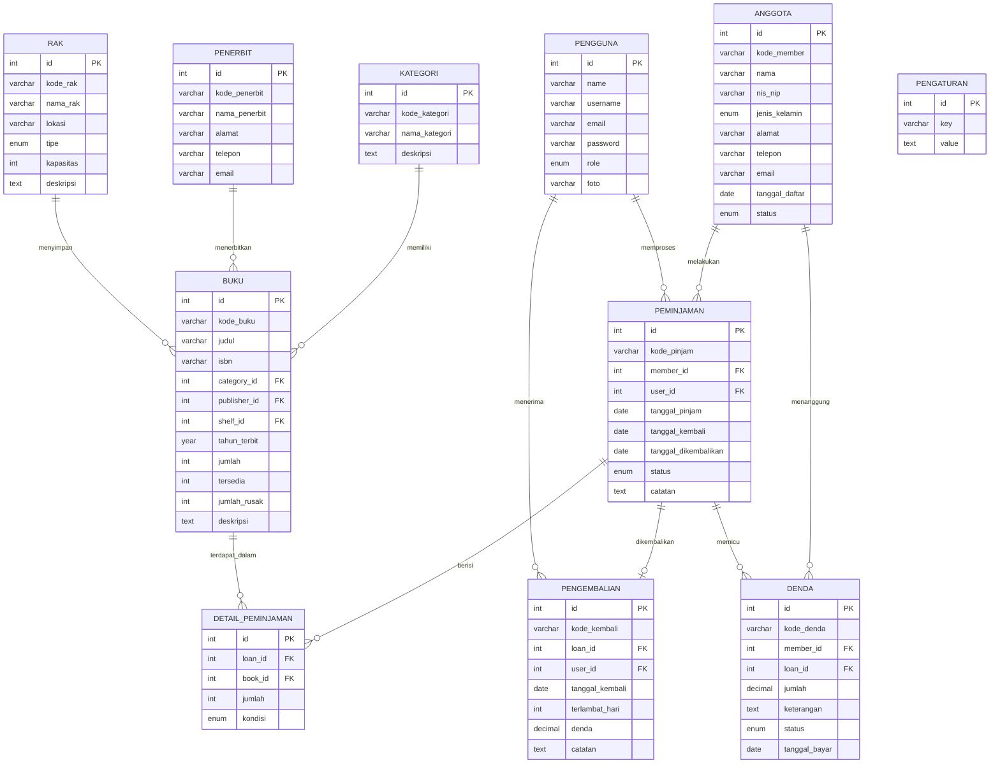

```mermaid
erDiagram

    KATEGORI ||--o{ BUKU : memiliki
    PENERBIT ||--o{ BUKU : menerbitkan
    RAK ||--o{ BUKU : menyimpan

    ANGGOTA ||--o{ PEMINJAMAN : melakukan
    PENGGUNA ||--o{ PEMINJAMAN : memproses

    PEMINJAMAN ||--o{ DETAIL_PEMINJAMAN : berisi
    BUKU ||--o{ DETAIL_PEMINJAMAN : terdapat_dalam

    PEMINJAMAN ||--o| PENGEMBALIAN : dikembalikan
    PENGGUNA ||--o{ PENGEMBALIAN : menerima

    ANGGOTA ||--o{ DENDA : menanggung
    PEMINJAMAN ||--o{ DENDA : memicu

    PENGGUNA {
        int id PK
        varchar name
        varchar username
        varchar email
        varchar password
        enum role
        varchar foto
    }

    KATEGORI {
        int id PK
        varchar kode_kategori
        varchar nama_kategori
        text deskripsi
    }

    PENERBIT {
        int id PK
        varchar kode_penerbit
        varchar nama_penerbit
        varchar alamat
        varchar telepon
        varchar email
    }

    RAK {
        int id PK
        varchar kode_rak
        varchar nama_rak
        varchar lokasi
        enum tipe
        int kapasitas
        text deskripsi
    }

    ANGGOTA {
        int id PK
        varchar kode_member
        varchar nama
        varchar nis_nip
        enum jenis_kelamin
        varchar alamat
        varchar telepon
        varchar email
        date tanggal_daftar
        enum status
    }

    BUKU {
        int id PK
        varchar kode_buku
        varchar judul
        varchar isbn
        int category_id FK
        int publisher_id FK
        int shelf_id FK
        year tahun_terbit
        int jumlah
        int tersedia
        int jumlah_rusak
        text deskripsi
    }

    PEMINJAMAN {
        int id PK
        varchar kode_pinjam
        int member_id FK
        int user_id FK
        date tanggal_pinjam
        date tanggal_kembali
        date tanggal_dikembalikan
        enum status
        text catatan
    }

    DETAIL_PEMINJAMAN {
        int id PK
        int loan_id FK
        int book_id FK
        int jumlah
        enum kondisi
    }

    PENGEMBALIAN {
        int id PK
        varchar kode_kembali
        int loan_id FK
        int user_id FK
        date tanggal_kembali
        int terlambat_hari
        decimal denda
        text catatan
    }

    DENDA {
        int id PK
        varchar kode_denda
        int member_id FK
        int loan_id FK
        decimal jumlah
        text keterangan
        enum status
        date tanggal_bayar
    }

    PENGATURAN {
        int id PK
        varchar key
        text value
    }
```